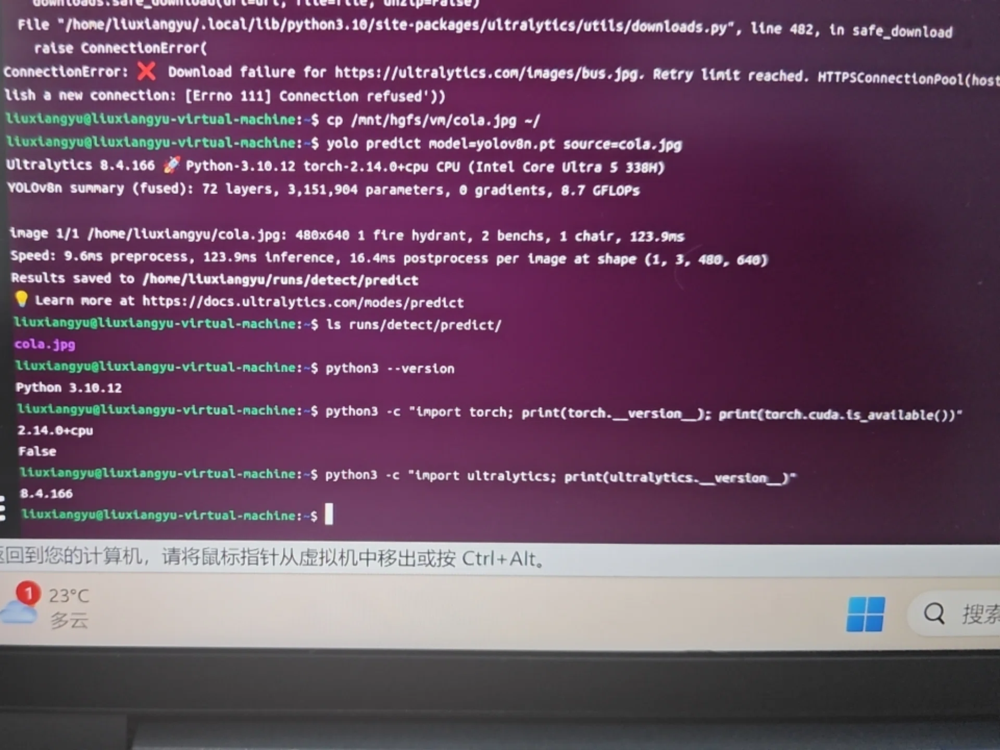
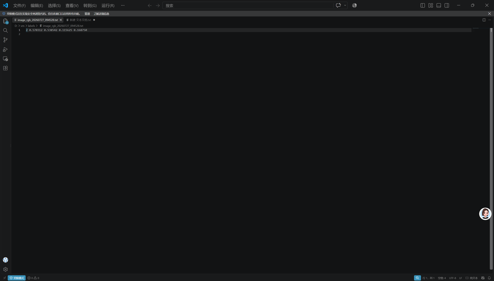
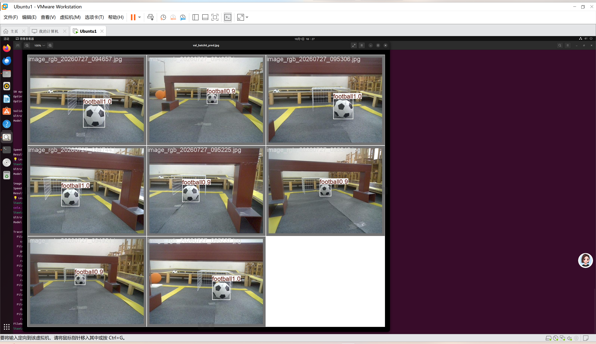

# YOLOv8目标检测项目实验报告
学号：202611160534
姓名：刘翔宇

## 一、实验概述
本项目使用YOLOv8模型完成多类别目标检测，分为5个Level逐步完成：环境搭建、数据集制作、模型训练、模型评估、可视化页面部署。

## Level1 环境搭建
搭建Ubuntu虚拟机环境，安装PyTorch、YOLOv8依赖库，完成基础推理测试，验证环境可用性。

## Level2 数据集制作
采集435张图像，使用LabelImg工具进行标注，生成YOLO格式txt标签文件。按照9:1划分数据集，训练集391张，验证集44张。

## Level3 模型训练
使用自制数据集训练YOLOv8模型，查看训练损失、精度指标。

## Level4 新图检测
使用自己训练得到的模型，对训练集之外的新图片进行目标检测。

## Level5 制作页面
在完成模型训练和新图片推理后，可以进一步将模型封装成一个简单的本地可视化应用。

