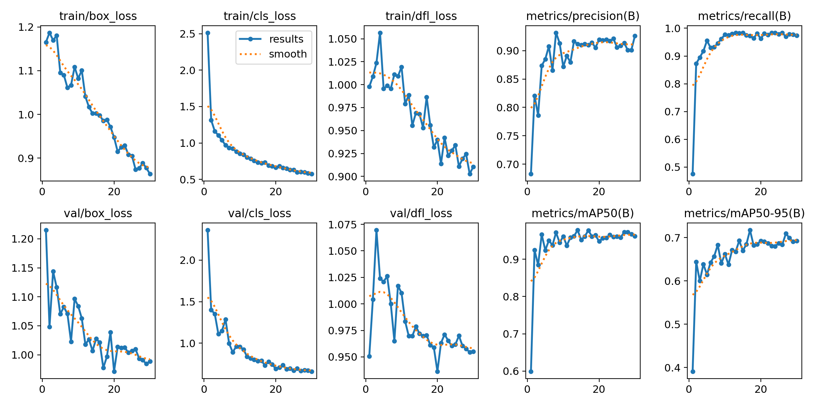
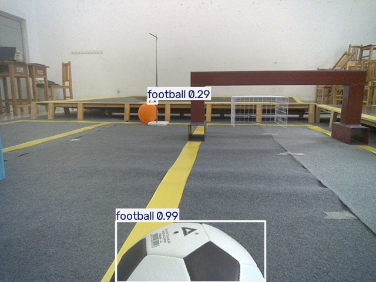
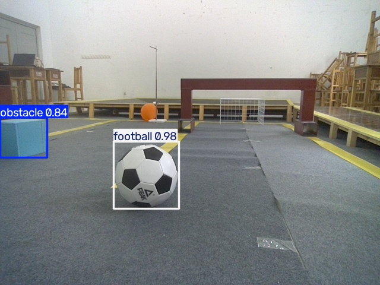

# 基于 YOLO 的机器人场景目标检测

## 1. 环境配置
- 操作系统：Windows 11
- Python：3.10
- PyTorch：2.14.1+cpu
- Ultralytics YOLO：8.4.174
- 是否使用 GPU：否（纯 CPU 训练）

安装验证截图：

## 2. 数据集整理
- 原始数据：obstacle、cola、football
- 训练集/验证集划分：使用提供的 dataset 目录（train/val 已划分）
- 标签类别：obstacle、cola、football

目录结构截图：

## 3. 目标标注
- 工具：X-AnyLabeling
- 类别编号：
  - 0 obstacle
  - 1 cola
  - 2 football

标注界面截图：

YOLO 标签文件内容截图：

## 4. 模型训练
- 模型：YOLOv8n
- 训练参数：epochs=30, imgsz=416, batch=4, device=cpu
- 最终指标：mAP50 = 0.977，Precision = 0.91，Recall = 0.973

训练终端截图：

训练过程 Loss、Precision、Recall 曲线：

## 5. 新图片推理（Level 4 及格线）

使用自己训练得到的 `best.pt`，对训练集之外的新图片进行推理，检测结果如下：

单目标检测：

多目标检测：

不同角度/场景检测：

结果分析：模型对足球、可乐、障碍物三类目标识别准确，最高置信度达 0.99，在 CPU 上单张推理约 8 毫秒。

## 6. 遇到的问题与解决
1. **GPU 版本下载太慢**：改用 CPU 版 PyTorch，训练 30 轮仅需约 7 分钟。
2. **labelImg 安装报错**：换用 X-AnyLabeling 进行标注，成功导出 YOLO 格式。
3. **训练时路径错误**：把 `data.yaml` 里的路径改为绝对路径后解决。